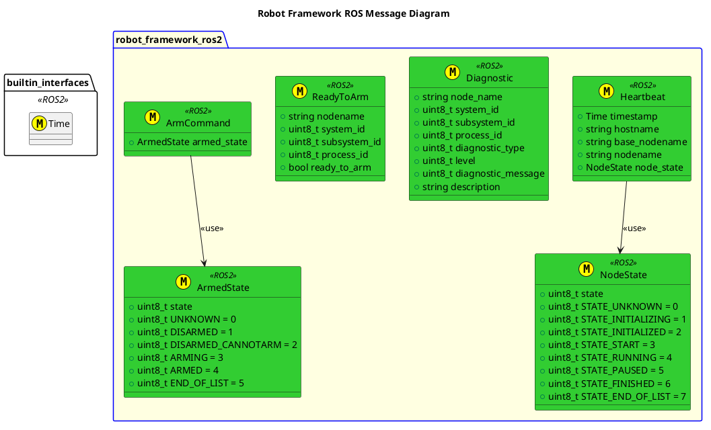
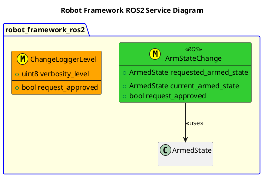

[](https://github.com/fastrobotics/robot_framework_ros2/actions/workflows/build-test.yml)

# FAST Robotics - Robot Framework: ROS v2 Middleware

- [FAST Robotics - Robot Framework: ROS v2 Middleware](#fast-robotics---robot-framework-ros-v2-middleware)
- [Architecture Design Records](#architecture-design-records)
- [Architecture](#architecture)
- [Interfaces](#interfaces)
- [Systems](#systems)
- [Features](#features)
- [Setup](#setup)
- [Build](#build)
  - [Build and run Unit Tests](#build-and-run-unit-tests)
- [Templates](#templates)

# Architecture Design Records
[ADR's](doc/ADR/ADR.md)


# Architecture


# Interfaces



# Systems
| Status | System                                                        |
| ------ | ------------------------------------------------------------- |
| DRAFT  | [Base Machine](Systems/BaseMachine/doc/System-BaseMachine.md) |
| DRAFT  | [Pose System](Systems/Pose/doc/System-Pose.md)                |
| DRAFT  | [Safety System](Systems/Safety/doc/System-Safety.md)          |

# Features
| Status | Feature                                          |
| ------ | ------------------------------------------------ |
| DRAFT  | [Core](include/robot_framework_ros2/doc/Core.md) |

# Setup

Pre-Requisites:

- Ubuntu system running 24.04 LTS

1. Clone this repo using:
```
git clone --recurse-submodules https://github.com/fastrobotics/robot_framework_ros2.git
cd robot_framework_ros2
git submodule update --remote
```
2. Run the following:

```
cd <repo>
./scripts/setup_ide.sh
./scripts/setup_robot.sh
```

# Build
To build, run the following:
```
cd <workspace>
colcon build
```

To refresh the cmake cache, instead run:
```
colcon build --cmake-clean-cache
```

## Build and run Unit Tests
```bash
cd <workspace>
colcon build
source install/setup.bash
colcon test --event-handlers console_cohesion+
```

# Templates
This project makes extensive use of cookiecutter templates.
| Template  | Folder                | Use Case                    |
| --------- | --------------------- | --------------------------- |
| System    | `templates/System`    | Used to create a System.    |
| Subsystem | `templates/Subsystem` | Used to create a Subsystem. |
| Node      | `templates/Node`      | Used to create a Node.      |

To use these templates, run:
```bash
cookiecutter <Template Folder containing cookiecutter.json> -o <OutputDirectory>
```

To Check if the templates are up to date with the implementation files, run:
```bash
python dev_tools/scripts/update_from_template.py --templates templates/<Template> --impl <Location to check>/
```