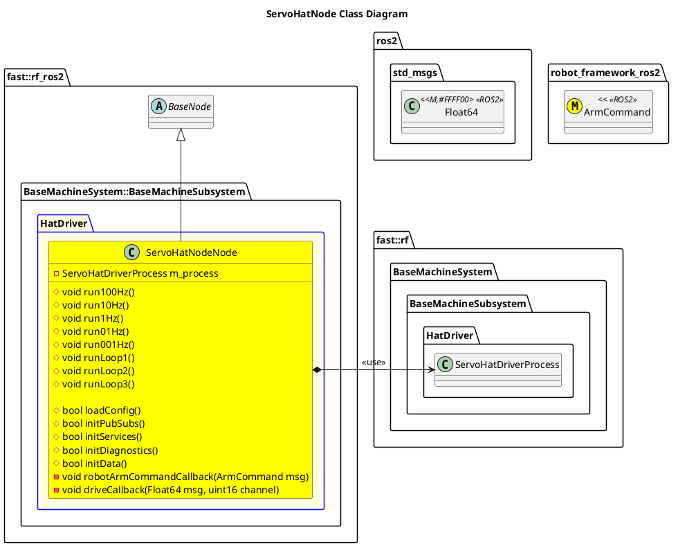

`@compare_tag Node-Document v0.2`
[Base Machine Subsystem](../../../doc/Subsystem-BaseMachine.md)
- [ServoHatNode](#servohatnode)
- [Architecture](#architecture)
  - [Class Diagram](#class-diagram)
- [Integration Guide](#integration-guide)
  - [Configuration](#configuration)
    - [Node Registry](#node-registry)

# ServoHatNode

# Architecture


## Class Diagram


# Integration Guide
## Configuration
### Node Registry
In your `node_registry.yaml` file, add the following:
```yaml
servo_hat_node: #Instance name of servo_hat_node, like servo_hat_node1, etc
    package: "robot_framework_ros2" 
    launch_file: "Systems/BaseMachine/Subsystems/BaseMachine/Nodes/ServoHatNode/launch/servo_hat_node.launch.xml" #Path to Launch File
    parameters: # Any parameter in xml launch file
      verbosity_level: "DEBUG"
      topic_left_drive: "left_drive"  # std_msgs/Float64
      topic_right_drive: "right_drive" # std_msgs/Float64
```