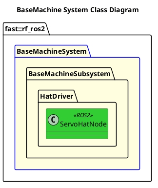

`@compare_tag System-Document v0.1`
[README](../../../README.md)

- [System: BaseMachine](#system-basemachine)
- [Overview](#overview)
  - [Purpose](#purpose)
  - [General Requirements](#general-requirements)
- [System Architecture](#system-architecture)
- [Inputs](#inputs)
- [Outputs](#outputs)
- [How It Works](#how-it-works)
  - [Detailed Documentation](#detailed-documentation)
  - [Software Content](#software-content)
- [Subsystems](#subsystems)
  - [Package Diagram](#package-diagram)
- [Usage Instructions](#usage-instructions)
- [Validation](#validation)

# System: BaseMachine

# Overview

## Purpose

The BaseMachine System's role in the ROS2 Robot Framework is to ???

## General Requirements

# System Architecture

# Inputs

The following inputs are required in order for this system to properly function.

| Input | DataType | Description | Requirement |
| ----- | -------- | ----------- | ----------- |

# Outputs

The following outputs are provided by this system.

| Output | DataType | Description | Usage |
| ------ | -------- | ----------- | ----- |

# How It Works

## Detailed Documentation

## Software Content

# Subsystems

The following Subsystems are provided in this System:

| State | Subsystem                                                              | Purpose |
| ----- | ---------------------------------------------------------------------- | ------- |
| DRAFT | [Base Machine](../Subsystems/BaseMachine/doc/Subsystem-BaseMachine.md) |         |

## Package Diagram

# Usage Instructions

# Validation

