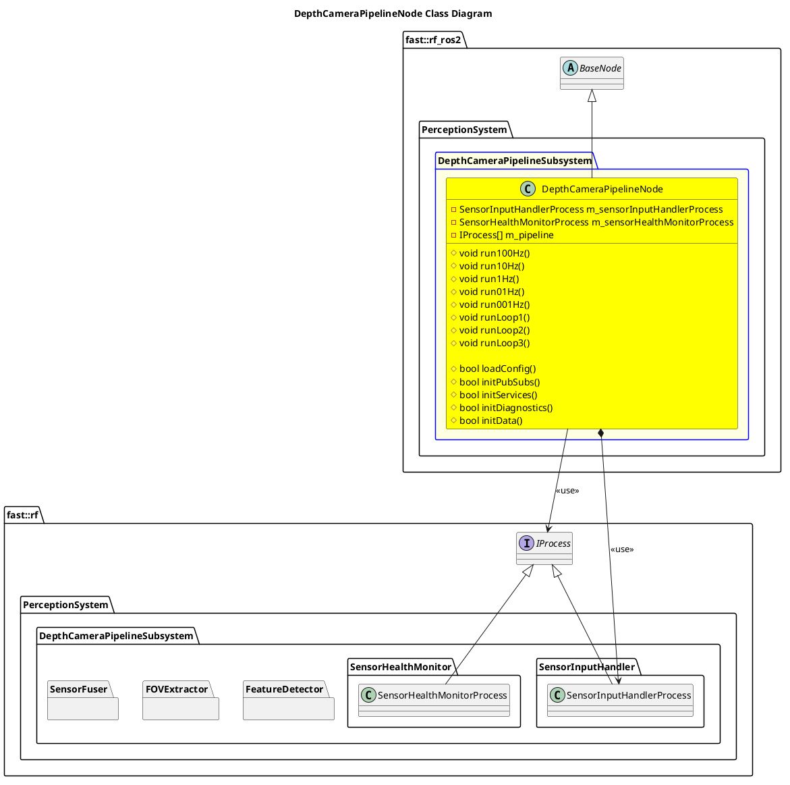

`@compare_tag Node-Document v0.2`

- [DepthCameraPipelineNode](#depthcamerapipelinenode)
- [Architecture](#architecture)
  - [Class Diagram](#class-diagram)
- [Integration Guide](#integration-guide)
  - [Configuration](#configuration)
    - [Node Registry](#node-registry)

# DepthCameraPipelineNode

# Architecture
![](../../../../../../../Legend.png

## Class Diagram


# Integration Guide
## Configuration
### Node Registry
In your `node_registry.yaml` file, add the following:
```yaml
depthcamera_pipeline_node: #Instance name of depthcamera_pipeline_node, like depthcamera_pipeline_node1, etc
    package: "robot_framework_ros2" 
    launch_file: "Systems/Perception/Subsystems/DepthCameraPipeline/Nodes/DepthCameraPipelineNode/launch/depthcamera_pipeline_node.launch.xml" #Path to Launch File
    parameters: # Any parameter in xml launch file
      verbosity_level: "DEBUG"
      sensor1_depthcamera_topic: depthcamera1_topic
      fused_depthcamera_topic: fused_depthcamera_topic
```