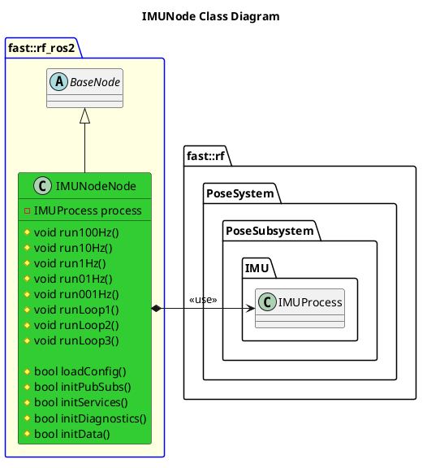

`@compare_tag Node-Document v0.1`

- [IMUNode Node](#imunode-node)
- [Architecture](#architecture)
  - [Class Diagram](#class-diagram)
- [Architecture](#architecture-1)
- [Integration Guide](#integration-guide)
  - [Configuration](#configuration)
    - [Node Registry](#node-registry)

# IMUNode Node

# Architecture


## Class Diagram


# Architecture

# Integration Guide
## Configuration
### Node Registry
In your `node_registry.yaml` file, add the following:
```yaml
imu_node: #Instance name of IMU Node, like imu_node1, etc
    package: "robot_framework_ros2" 
    launch_file: "Systems/Pose/Subsystems/InertialSensor/Nodes/IMUNode/launch/imu_node.launch.xml" #Path to IMU Launch File
    parameters: # Any parameter in xml launch file
      verbosity_level: "DEBUG"
      target_frame: "body_frame"
      imu_topic: "robot_imu"
      accel_topic: "robot_accel"
      magnetic_topic: "robot_imu_magnetic"
```