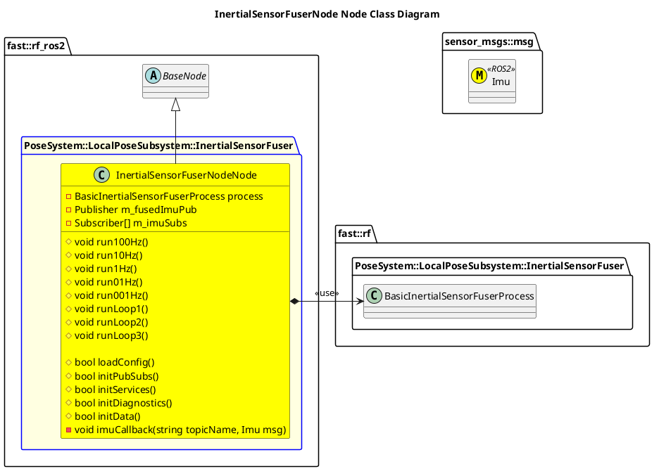

`@compare_tag Node-Document v0.2`

- [InertialSensorFuserNode Node](#cookiecutternode-node)
- [Architecture](#architecture)
  - [Class Diagram](#class-diagram)
- [Integration Guide](#integration-guide)
  - [Configuration](#configuration)
    - [Node Registry](#node-registry)

# InertialSensorFuserNode Node

# Architecture


## Class Diagram


# Integration Guide
## Configuration
### Node Registry
In your `node_registry.yaml` file, add the following:
```yaml
inertial_sensor_fuser_node: #Instance name of inertial_sensor_fuser_node, like inertial_sensor_fuser_node1, etc
    package: "robot_framework_ros2" 
    launch_file: "Systems/Pose/Subsystems/LocalPose/Nodes/InertialSensorFuserNode/launch/inertial_sensor_fuser_node.launch.xml" #Path to Launch File
    parameters: # Any parameter in xml launch file
      verbosity_level: "DEBUG"
```