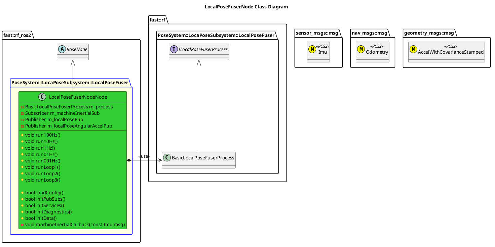

`@compare_tag Node-Document v0.2`

- [LocalPoseFuserNode](#localposefusernode)
- [Architecture](#architecture)
  - [Class Diagram](#class-diagram)
- [Integration Guide](#integration-guide)
  - [Configuration](#configuration)
    - [Node Registry](#node-registry)

# LocalPoseFuserNode

# Architecture


## Class Diagram


# Integration Guide
## Configuration
### Node Registry
In your `node_registry.yaml` file, add the following:
```yaml
local_pose_fuser_node: #Instance name of local_pose_fuser_node, like local_pose_fuser_node1, etc
    package: "robot_framework_ros2" 
    launch_file: "Systems/Pose/Subsystems/LocalPose/Nodes/LocalPoseFuserNode/launch/local_pose_fuser_node.launch.xml" #Path to Launch File
    parameters: # Any parameter in xml launch file
      verbosity_level: "DEBUG"
      machine_inertial_input_topic: "imu" # Multiple IMU's will be supported in AB#1814
      local_pose_output_topic: "local_pose"
      local_pose_angular_accel_output_topic: "local_pose_angular_accel"
```