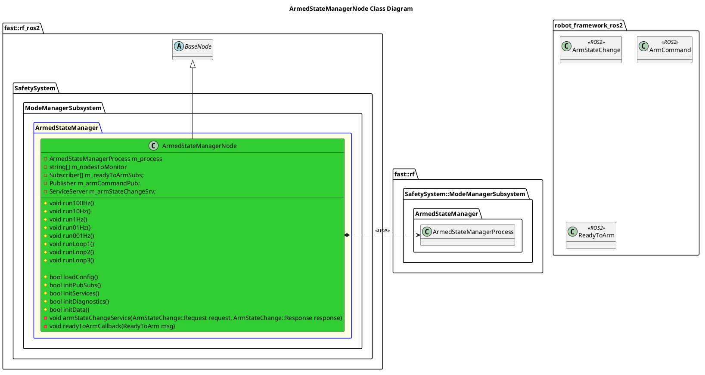

`@compare_tag Node-Document v0.2`

- [ArmedStateManagerNode](#armedstatemanagernode)
- [Architecture](#architecture)
  - [Class Diagram](#class-diagram)
- [Integration Guide](#integration-guide)
  - [Configuration](#configuration)
    - [Node Registry](#node-registry)

# ArmedStateManagerNode
This node's objective is the following:
- Receive multiple Ready To Arm signals from Nodes.
- Publish an Arm Command based on the Ready To Arm signals and a user request
- Provide a service to the user to request an Arm State Change.

# Architecture


## Class Diagram


# Integration Guide
## Configuration
### Node Registry
In your `node_registry.yaml` file, add the following:
```yaml
armed_state_manager_node: #Instance name of armed_state_manager_node, like armed_state_manager_node1, etc
    package: "robot_framework_ros2" 
    launch_file: "Systems/Safety/Subsystems/ModeManager/Nodes/ArmedStateManagerNode/launch/armed_state_manager_node.launch.xml" #Path to Launch File
    parameters: # Any parameter in xml launch file
      verbosity_level: "DEBUG"
      topic_arm_command: "arm_command" # robot_framework_ros2/ArmCommand
```