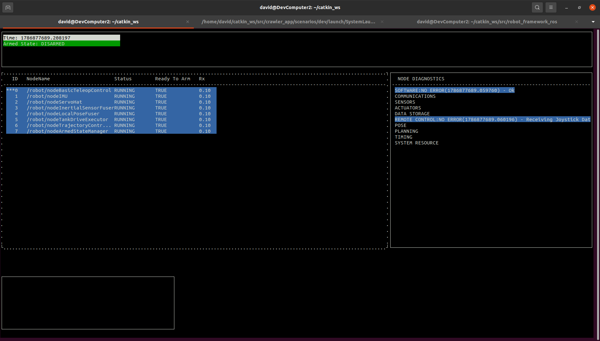
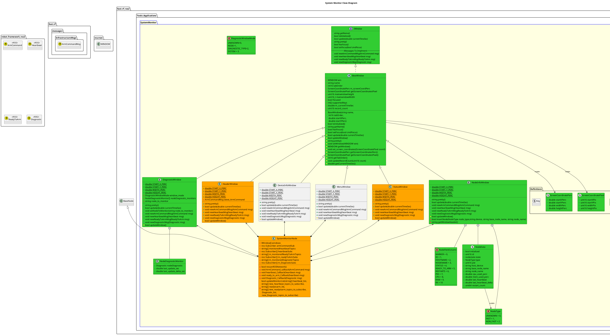

[Applications](../../doc/Applications.md)

- [System Monitor](#system-monitor)
  - [Overview](#overview)
  - [Requirements](#requirements)
  - [Graphic Design](#graphic-design)
  - [Execution](#execution)
  - [Software Design](#software-design)
    - [Class Diagram](#class-diagram)
  - [Windows](#windows)
    - [Header](#header)
    - [Node Info](#node-info)
      - [Adding a new field](#adding-a-new-field)
    - [Node/Aggregated Diagnostic Type/System Diagnostics](#nodeaggregated-diagnostic-typesystem-diagnostics)
    - [Command Output](#command-output)
    - [Status Window](#status-window)
    - [Menu Options](#menu-options)
    - [Device Info](#device-info)

# System Monitor

## Overview
The System Monitor Application provides a portable graphical interface to inspect the status of a Robot.



## Requirements
The System Monitor has the following requirements:
| Requirement                                                                                          |
| ---------------------------------------------------------------------------------------------------- |
| Can be run directly from command line                                                                |
| Can be run from a remote command line (ssh)                                                          |
| Is not required to be run on a robot.  Can be killed without any negative effect on robot operation. |
 
## Graphic Design


## Execution
To run, do the following:
```bash
rosrun robot_framework_ros system_monitor _robot_namespace:=/robot 
```
## Software Design

### Class Diagram


## Windows
The following Windows are supported in the System Monitor:
### Header
The Header Window provides quick run-time status, such as:
- Armed State
- Current Time
- Pose

### Node Info
The Node Info Window provides details on every Node running on the system.  This is an extensive Window. 
The following information is currently reported in this Window:
- Node Name
- The Node State
- If the Node is in a Ready To Arm State or Not
- How long since the Node has been updated in the System Monitor

Here are some maintenance notes:
#### Adding a new field
- To add a new field to be displayed, there are 3 main sections of the code to modify.  Additionally there is a prerequisite that the data that is going to be populated in the field is already being computed.
First, before making a code change, inspect the System Monitor Class Diagram and determine the appropriate architecture changes required.
Next in the code, update the following:
1. In the header of the NodeInfoWindow's, add the following:
```code
 enum class NodeFieldColumn {
    <existing entry = #>
    ...
    <new entry = previous # + 1>
    ...
    <update all existing entries with new index>
```
1. In the header Constructor, add the following:
```code
node_window_fields.insert(
                std::pair<NodeFieldColumn, Field>(NodeFieldColumn::<Existing Field>,<blah>);
node_window_fields.insert(
                std::pair<NodeFieldColumn, Field>(NodeFieldColumn::<New Field>, Field(<Field Header Text>, <Width of Field.  This should be at a minimum of the max of (the Header name,any data that will be populated)>)));  If the text to be displayed may exceed this, make sure to limit the size displayed in the implementation.
```
1. In the cpp function `get_node_info`, add the following:
```code
<existing field lookups>
it = node_window_fields.find(NodeFieldColumn::<New Field>);
if (it != node_window_fields.end()) {
    std::string tempstr =  <Some String>
    std::size_t spaces = it->second.width - tempstr.size();
    if (spaces > 0) {
        tempstr += std::string(spaces, ' ');
    }
    str += tempstr;
}
```


### Node/Aggregated Diagnostic Type/System Diagnostics
This window displays Diagnostic details, either for the entire system, or for the specific Node.

This will be extended in AB#1838.

### Command Output
This small window displays the status of various commands requested from the System Monitor (such as changing the Node Logger Level, requesting a snapshot, etc).

### Status Window
This is a generic Window that provides details like:
- What kind of data collection is running
- What the name of the application is
- Source Code information

### Menu Options
This window displays to the user what options are available.  Note that this window is dynamic as the operations available can change over time.

### Device Info
This window displays device health information.  This will be implemented during AB#1837.