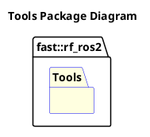

[README](../../README.md)

- [System: Tools](#system-tools)
- [Overview](#overview)
  - [Purpose](#purpose)
  - [General Requirements](#general-requirements)
- [System Architecture](#system-architecture)
- [Inputs](#inputs)
- [Outputs](#outputs)
- [How It Works](#how-it-works)
  - [Detailed Documentation](#detailed-documentation)
  - [Software Content](#software-content)
- [Tool Groups](#tool-groups)
  - [Package Diagram](#package-diagram)
- [Usage Instructions](#usage-instructions)
- [Validation](#validation)

# System: Tools

# Overview

## Purpose

The Tools System's role in the Robot Framework is to provide content that is not typically ran onboard a robot, but can be based on desired development needs.

## General Requirements

# System Architecture

# Inputs

The following inputs are required in order for this system to properly function.

| Input | DataType | Description | Requirement |
| ----- | -------- | ----------- | ----------- |

# Outputs

The following outputs are provided by this system.

| Output | DataType | Description | Usage |
| ------ | -------- | ----------- | ----- |

# How It Works

## Detailed Documentation

## Software Content

# Tool Groups
The following Tool Groups are supported:
| Tool Group                                          | Brief Description                           |
| --------------------------------------------------- | ------------------------------------------- |
| [Applications](../Applications/doc/Applications.md) | Stand-alone tools that can be run directly. |

## Package Diagram

# Usage Instructions

# Validation

