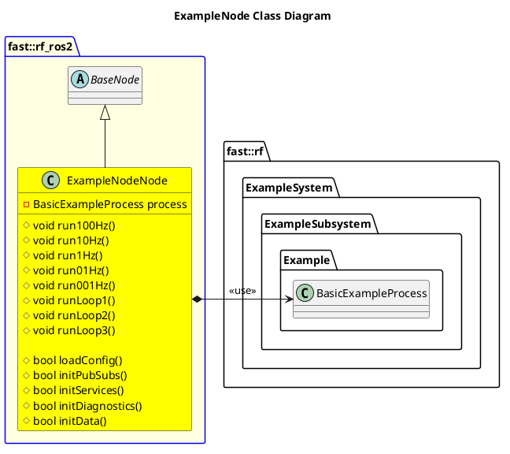

`@compare_tag Node-Document v0.2`

- [ExampleNode](#examplenode)
- [Architecture](#architecture)
  - [Class Diagram](#class-diagram)
- [Integration Guide](#integration-guide)
  - [Configuration](#configuration)
    - [Node Registry](#node-registry)

# ExampleNode

# Architecture


## Class Diagram


# Integration Guide
## Configuration
### Node Registry
In your `node_registry.yaml` file, add the following:
```yaml
example_node: #Instance name of example_node, like example_node1, etc
    package: "robot_framework_ros2" 
    launch_file: "Systems/Example/Subsystems/Example/Nodes/ExampleNode/launch/example_node.launch.xml" #Path to Launch File
    parameters: # Any parameter in xml launch file
      verbosity_level: "DEBUG"
```